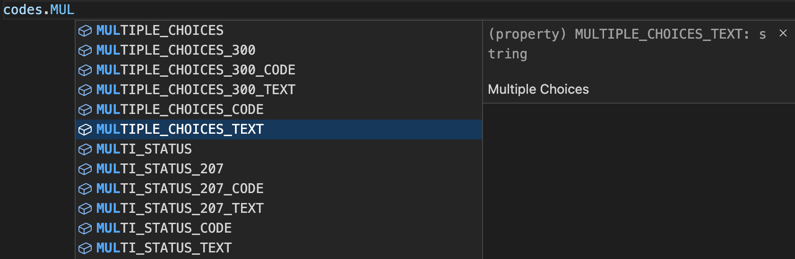

# readable-http-status-codes

[![License][license-image]][license-url] [![NPM Package Version][npm-image-version]][npm-url] ![GitHub top language][language-image] ![Size][size-image] ![Last Commit][commit-image]

By writing readable http status codes your code becomes even more readable and easier to understand.

> Some status codes are for most developers clear e.g. `200`, `404` or `500`. But few developers can tell what `402`, `426` or `501` means without looking up. Writing codes that require someone reading it to stop and look something up, should be avoided whenever possible.

This package provides you the full list ([see below](#list-of-all-keys)) of all http status codes available on the nodejs core module **http**. So you can write

`PAYMENT_REQUIRED` or `PAYMENT_REQUIRED_CODE` instead of 402

`UPGRADE_REQUIRED` or `UPGRADE_REQUIRED_CODE` instead of 426

`NOT_IMPLEMENTED` or `NOT_IMPLEMENTED_CODE` instead of 501

`IM_A_TEAPOT` or `IM_A_TEAPOT_CODE` instead of 418

...

And to retrieve the status messages use

`PAYMENT_REQUIRED_TEXT` to return `Payment Required`

`UPGRADE_REQUIRED_TEXT` to return `Upgrade Required`

`NOT_IMPLEMENTED_TEXT` to return `Not Implemented`

`IM_A_TEAPOT_TEXT` to return `I'm a Teapot`

...

Intellisense support included (tested in VS Code editor) so you code faster.


## Installation

```bash
$ npm i readable-http-status-codes
```

## Usage

##### Require CommonJS (default)

```js
const status_codes = require("readable-http-status-codes");
```

##### Import ES-Module (default)

```js
import status_codes from "readable-http-status-codes";
```

##### Import ES-Module (named)

```js
import { readable_http_status_codes as status_codes } from "readable-http-status-codes";
```

##### Some examples based on express

```js
res.status(status_codes.OK).json({
    /* data */
});
```

```js
res.sendStatus(status_codes.BAD_REQUEST);
```

```js
res.sendStatus(status_codes.NO_CONTENT);
```

### List of all keys

It is the full list of all HTTP status codes provided by nodejs core module **http**.

| KEY                                      | Value                           |
| ---------------------------------------- | ------------------------------- |
| CONTINUE                                 | 100                             |
| CONTINUE_CODE                            | 100                             |
| CONTINUE_TEXT                            | Continue                        |
| CONTINUE_100                             | 100                             |
| CONTINUE_100_CODE                        | 100                             |
| CONTINUE_100_TEXT                        | Continue                        |
| SWITCHING_PROTOCOLS                      | 101                             |
| SWITCHING_PROTOCOLS_CODE                 | 101                             |
| SWITCHING_PROTOCOLS_TEXT                 | Switching Protocols             |
| SWITCHING_PROTOCOLS_101                  | 101                             |
| SWITCHING_PROTOCOLS_101_CODE             | 101                             |
| SWITCHING_PROTOCOLS_101_TEXT             | Switching Protocols             |
| PROCESSING                               | 102                             |
| PROCESSING_CODE                          | 102                             |
| PROCESSING_TEXT                          | Processing                      |
| PROCESSING_102                           | 102                             |
| PROCESSING_102_CODE                      | 102                             |
| PROCESSING_102_TEXT                      | Processing                      |
| EARLY_HINTS                              | 103                             |
| EARLY_HINTS_CODE                         | 103                             |
| EARLY_HINTS_TEXT                         | Early Hints                     |
| EARLY_HINTS_103                          | 103                             |
| EARLY_HINTS_103_CODE                     | 103                             |
| EARLY_HINTS_103_TEXT                     | Early Hints                     |
| OK                                       | 200                             |
| OK_CODE                                  | 200                             |
| OK_TEXT                                  | OK                              |
| OK_200                                   | 200                             |
| OK_200_CODE                              | 200                             |
| OK_200_TEXT                              | OK                              |
| CREATED                                  | 201                             |
| CREATED_CODE                             | 201                             |
| CREATED_TEXT                             | Created                         |
| CREATED_201                              | 201                             |
| CREATED_201_CODE                         | 201                             |
| CREATED_201_TEXT                         | Created                         |
| ACCEPTED                                 | 202                             |
| ACCEPTED_CODE                            | 202                             |
| ACCEPTED_TEXT                            | Accepted                        |
| ACCEPTED_202                             | 202                             |
| ACCEPTED_202_CODE                        | 202                             |
| ACCEPTED_202_TEXT                        | Accepted                        |
| NON_AUTHORITATIVE_INFORMATION            | 203                             |
| NON_AUTHORITATIVE_INFORMATION_CODE       | 203                             |
| NON_AUTHORITATIVE_INFORMATION_TEXT       | Non-Authoritative Information   |
| NON_AUTHORITATIVE_INFORMATION_203        | 203                             |
| NON_AUTHORITATIVE_INFORMATION_203_CODE   | 203                             |
| NON_AUTHORITATIVE_INFORMATION_203_TEXT   | Non-Authoritative Information   |
| NO_CONTENT                               | 204                             |
| NO_CONTENT_CODE                          | 204                             |
| NO_CONTENT_TEXT                          | No Content                      |
| NO_CONTENT_204                           | 204                             |
| NO_CONTENT_204_CODE                      | 204                             |
| NO_CONTENT_204_TEXT                      | No Content                      |
| RESET_CONTENT                            | 205                             |
| RESET_CONTENT_CODE                       | 205                             |
| RESET_CONTENT_TEXT                       | Reset Content                   |
| RESET_CONTENT_205                        | 205                             |
| RESET_CONTENT_205_CODE                   | 205                             |
| RESET_CONTENT_205_TEXT                   | Reset Content                   |
| PARTIAL_CONTENT                          | 206                             |
| PARTIAL_CONTENT_CODE                     | 206                             |
| PARTIAL_CONTENT_TEXT                     | Partial Content                 |
| PARTIAL_CONTENT_206                      | 206                             |
| PARTIAL_CONTENT_206_CODE                 | 206                             |
| PARTIAL_CONTENT_206_TEXT                 | Partial Content                 |
| MULTI_STATUS                             | 207                             |
| MULTI_STATUS_CODE                        | 207                             |
| MULTI_STATUS_TEXT                        | Multi-Status                    |
| MULTI_STATUS_207                         | 207                             |
| MULTI_STATUS_207_CODE                    | 207                             |
| MULTI_STATUS_207_TEXT                    | Multi-Status                    |
| ALREADY_REPORTED                         | 208                             |
| ALREADY_REPORTED_CODE                    | 208                             |
| ALREADY_REPORTED_TEXT                    | Already Reported                |
| ALREADY_REPORTED_208                     | 208                             |
| ALREADY_REPORTED_208_CODE                | 208                             |
| ALREADY_REPORTED_208_TEXT                | Already Reported                |
| IM_USED                                  | 226                             |
| IM_USED_CODE                             | 226                             |
| IM_USED_TEXT                             | IM Used                         |
| IM_USED_226                              | 226                             |
| IM_USED_226_CODE                         | 226                             |
| IM_USED_226_TEXT                         | IM Used                         |
| MULTIPLE_CHOICES                         | 300                             |
| MULTIPLE_CHOICES_CODE                    | 300                             |
| MULTIPLE_CHOICES_TEXT                    | Multiple Choices                |
| MULTIPLE_CHOICES_300                     | 300                             |
| MULTIPLE_CHOICES_300_CODE                | 300                             |
| MULTIPLE_CHOICES_300_TEXT                | Multiple Choices                |
| MOVED_PERMANENTLY                        | 301                             |
| MOVED_PERMANENTLY_CODE                   | 301                             |
| MOVED_PERMANENTLY_TEXT                   | Moved Permanently               |
| MOVED_PERMANENTLY_301                    | 301                             |
| MOVED_PERMANENTLY_301_CODE               | 301                             |
| MOVED_PERMANENTLY_301_TEXT               | Moved Permanently               |
| FOUND                                    | 302                             |
| FOUND_CODE                               | 302                             |
| FOUND_TEXT                               | Found                           |
| FOUND_302                                | 302                             |
| FOUND_302_CODE                           | 302                             |
| FOUND_302_TEXT                           | Found                           |
| SEE_OTHER                                | 303                             |
| SEE_OTHER_CODE                           | 303                             |
| SEE_OTHER_TEXT                           | See Other                       |
| SEE_OTHER_303                            | 303                             |
| SEE_OTHER_303_CODE                       | 303                             |
| SEE_OTHER_303_TEXT                       | See Other                       |
| NOT_MODIFIED                             | 304                             |
| NOT_MODIFIED_CODE                        | 304                             |
| NOT_MODIFIED_TEXT                        | Not Modified                    |
| NOT_MODIFIED_304                         | 304                             |
| NOT_MODIFIED_304_CODE                    | 304                             |
| NOT_MODIFIED_304_TEXT                    | Not Modified                    |
| USE_PROXY                                | 305                             |
| USE_PROXY_CODE                           | 305                             |
| USE_PROXY_TEXT                           | Use Proxy                       |
| USE_PROXY_305                            | 305                             |
| USE_PROXY_305_CODE                       | 305                             |
| USE_PROXY_305_TEXT                       | Use Proxy                       |
| TEMPORARY_REDIRECT                       | 307                             |
| TEMPORARY_REDIRECT_CODE                  | 307                             |
| TEMPORARY_REDIRECT_TEXT                  | Temporary Redirect              |
| TEMPORARY_REDIRECT_307                   | 307                             |
| TEMPORARY_REDIRECT_307_CODE              | 307                             |
| TEMPORARY_REDIRECT_307_TEXT              | Temporary Redirect              |
| PERMANENT_REDIRECT                       | 308                             |
| PERMANENT_REDIRECT_CODE                  | 308                             |
| PERMANENT_REDIRECT_TEXT                  | Permanent Redirect              |
| PERMANENT_REDIRECT_308                   | 308                             |
| PERMANENT_REDIRECT_308_CODE              | 308                             |
| PERMANENT_REDIRECT_308_TEXT              | Permanent Redirect              |
| BAD_REQUEST                              | 400                             |
| BAD_REQUEST_CODE                         | 400                             |
| BAD_REQUEST_TEXT                         | Bad Request                     |
| BAD_REQUEST_400                          | 400                             |
| BAD_REQUEST_400_CODE                     | 400                             |
| BAD_REQUEST_400_TEXT                     | Bad Request                     |
| UNAUTHORIZED                             | 401                             |
| UNAUTHORIZED_CODE                        | 401                             |
| UNAUTHORIZED_TEXT                        | Unauthorized                    |
| UNAUTHORIZED_401                         | 401                             |
| UNAUTHORIZED_401_CODE                    | 401                             |
| UNAUTHORIZED_401_TEXT                    | Unauthorized                    |
| PAYMENT_REQUIRED                         | 402                             |
| PAYMENT_REQUIRED_CODE                    | 402                             |
| PAYMENT_REQUIRED_TEXT                    | Payment Required                |
| PAYMENT_REQUIRED_402                     | 402                             |
| PAYMENT_REQUIRED_402_CODE                | 402                             |
| PAYMENT_REQUIRED_402_TEXT                | Payment Required                |
| FORBIDDEN                                | 403                             |
| FORBIDDEN_CODE                           | 403                             |
| FORBIDDEN_TEXT                           | Forbidden                       |
| FORBIDDEN_403                            | 403                             |
| FORBIDDEN_403_CODE                       | 403                             |
| FORBIDDEN_403_TEXT                       | Forbidden                       |
| NOT_FOUND                                | 404                             |
| NOT_FOUND_CODE                           | 404                             |
| NOT_FOUND_TEXT                           | Not Found                       |
| NOT_FOUND_404                            | 404                             |
| NOT_FOUND_404_CODE                       | 404                             |
| NOT_FOUND_404_TEXT                       | Not Found                       |
| METHOD_NOT_ALLOWED                       | 405                             |
| METHOD_NOT_ALLOWED_CODE                  | 405                             |
| METHOD_NOT_ALLOWED_TEXT                  | Method Not Allowed              |
| METHOD_NOT_ALLOWED_405                   | 405                             |
| METHOD_NOT_ALLOWED_405_CODE              | 405                             |
| METHOD_NOT_ALLOWED_405_TEXT              | Method Not Allowed              |
| NOT_ACCEPTABLE                           | 406                             |
| NOT_ACCEPTABLE_CODE                      | 406                             |
| NOT_ACCEPTABLE_TEXT                      | Not Acceptable                  |
| NOT_ACCEPTABLE_406                       | 406                             |
| NOT_ACCEPTABLE_406_CODE                  | 406                             |
| NOT_ACCEPTABLE_406_TEXT                  | Not Acceptable                  |
| PROXY_AUTHENTICATION_REQUIRED            | 407                             |
| PROXY_AUTHENTICATION_REQUIRED_CODE       | 407                             |
| PROXY_AUTHENTICATION_REQUIRED_TEXT       | Proxy Authentication Required   |
| PROXY_AUTHENTICATION_REQUIRED_407        | 407                             |
| PROXY_AUTHENTICATION_REQUIRED_407_CODE   | 407                             |
| PROXY_AUTHENTICATION_REQUIRED_407_TEXT   | Proxy Authentication Required   |
| REQUEST_TIMEOUT                          | 408                             |
| REQUEST_TIMEOUT_CODE                     | 408                             |
| REQUEST_TIMEOUT_TEXT                     | Request Timeout                 |
| REQUEST_TIMEOUT_408                      | 408                             |
| REQUEST_TIMEOUT_408_CODE                 | 408                             |
| REQUEST_TIMEOUT_408_TEXT                 | Request Timeout                 |
| CONFLICT                                 | 409                             |
| CONFLICT_CODE                            | 409                             |
| CONFLICT_TEXT                            | Conflict                        |
| CONFLICT_409                             | 409                             |
| CONFLICT_409_CODE                        | 409                             |
| CONFLICT_409_TEXT                        | Conflict                        |
| GONE                                     | 410                             |
| GONE_CODE                                | 410                             |
| GONE_TEXT                                | Gone                            |
| GONE_410                                 | 410                             |
| GONE_410_CODE                            | 410                             |
| GONE_410_TEXT                            | Gone                            |
| LENGTH_REQUIRED                          | 411                             |
| LENGTH_REQUIRED_CODE                     | 411                             |
| LENGTH_REQUIRED_TEXT                     | Length Required                 |
| LENGTH_REQUIRED_411                      | 411                             |
| LENGTH_REQUIRED_411_CODE                 | 411                             |
| LENGTH_REQUIRED_411_TEXT                 | Length Required                 |
| PRECONDITION_FAILED                      | 412                             |
| PRECONDITION_FAILED_CODE                 | 412                             |
| PRECONDITION_FAILED_TEXT                 | Precondition Failed             |
| PRECONDITION_FAILED_412                  | 412                             |
| PRECONDITION_FAILED_412_CODE             | 412                             |
| PRECONDITION_FAILED_412_TEXT             | Precondition Failed             |
| PAYLOAD_TOO_LARGE                        | 413                             |
| PAYLOAD_TOO_LARGE_CODE                   | 413                             |
| PAYLOAD_TOO_LARGE_TEXT                   | Payload Too Large               |
| PAYLOAD_TOO_LARGE_413                    | 413                             |
| PAYLOAD_TOO_LARGE_413_CODE               | 413                             |
| PAYLOAD_TOO_LARGE_413_TEXT               | Payload Too Large               |
| URI_TOO_LONG                             | 414                             |
| URI_TOO_LONG_CODE                        | 414                             |
| URI_TOO_LONG_TEXT                        | URI Too Long                    |
| URI_TOO_LONG_414                         | 414                             |
| URI_TOO_LONG_414_CODE                    | 414                             |
| URI_TOO_LONG_414_TEXT                    | URI Too Long                    |
| UNSUPPORTED_MEDIA_TYPE                   | 415                             |
| UNSUPPORTED_MEDIA_TYPE_CODE              | 415                             |
| UNSUPPORTED_MEDIA_TYPE_TEXT              | Unsupported Media Type          |
| UNSUPPORTED_MEDIA_TYPE_415               | 415                             |
| UNSUPPORTED_MEDIA_TYPE_415_CODE          | 415                             |
| UNSUPPORTED_MEDIA_TYPE_415_TEXT          | Unsupported Media Type          |
| RANGE_NOT_SATISFIABLE                    | 416                             |
| RANGE_NOT_SATISFIABLE_CODE               | 416                             |
| RANGE_NOT_SATISFIABLE_TEXT               | Range Not Satisfiable           |
| RANGE_NOT_SATISFIABLE_416                | 416                             |
| RANGE_NOT_SATISFIABLE_416_CODE           | 416                             |
| RANGE_NOT_SATISFIABLE_416_TEXT           | Range Not Satisfiable           |
| EXPECTATION_FAILED                       | 417                             |
| EXPECTATION_FAILED_CODE                  | 417                             |
| EXPECTATION_FAILED_TEXT                  | Expectation Failed              |
| EXPECTATION_FAILED_417                   | 417                             |
| EXPECTATION_FAILED_417_CODE              | 417                             |
| EXPECTATION_FAILED_417_TEXT              | Expectation Failed              |
| IM_A_TEAPOT                              | 418                             |
| IM_A_TEAPOT_CODE                         | 418                             |
| IM_A_TEAPOT_TEXT                         | I'm a Teapot                    |
| IM_A_TEAPOT_418                          | 418                             |
| IM_A_TEAPOT_418_CODE                     | 418                             |
| IM_A_TEAPOT_418_TEXT                     | I'm a Teapot                    |
| MISDIRECTED_REQUEST                      | 421                             |
| MISDIRECTED_REQUEST_CODE                 | 421                             |
| MISDIRECTED_REQUEST_TEXT                 | Misdirected Request             |
| MISDIRECTED_REQUEST_421                  | 421                             |
| MISDIRECTED_REQUEST_421_CODE             | 421                             |
| MISDIRECTED_REQUEST_421_TEXT             | Misdirected Request             |
| UNPROCESSABLE_ENTITY                     | 422                             |
| UNPROCESSABLE_ENTITY_CODE                | 422                             |
| UNPROCESSABLE_ENTITY_TEXT                | Unprocessable Entity            |
| UNPROCESSABLE_ENTITY_422                 | 422                             |
| UNPROCESSABLE_ENTITY_422_CODE            | 422                             |
| UNPROCESSABLE_ENTITY_422_TEXT            | Unprocessable Entity            |
| LOCKED                                   | 423                             |
| LOCKED_CODE                              | 423                             |
| LOCKED_TEXT                              | Locked                          |
| LOCKED_423                               | 423                             |
| LOCKED_423_CODE                          | 423                             |
| LOCKED_423_TEXT                          | Locked                          |
| FAILED_DEPENDENCY                        | 424                             |
| FAILED_DEPENDENCY_CODE                   | 424                             |
| FAILED_DEPENDENCY_TEXT                   | Failed Dependency               |
| FAILED_DEPENDENCY_424                    | 424                             |
| FAILED_DEPENDENCY_424_CODE               | 424                             |
| FAILED_DEPENDENCY_424_TEXT               | Failed Dependency               |
| TOO_EARLY                                | 425                             |
| TOO_EARLY_CODE                           | 425                             |
| TOO_EARLY_TEXT                           | Too Early                       |
| TOO_EARLY_425                            | 425                             |
| TOO_EARLY_425_CODE                       | 425                             |
| TOO_EARLY_425_TEXT                       | Too Early                       |
| UPGRADE_REQUIRED                         | 426                             |
| UPGRADE_REQUIRED_CODE                    | 426                             |
| UPGRADE_REQUIRED_TEXT                    | Upgrade Required                |
| UPGRADE_REQUIRED_426                     | 426                             |
| UPGRADE_REQUIRED_426_CODE                | 426                             |
| UPGRADE_REQUIRED_426_TEXT                | Upgrade Required                |
| PRECONDITION_REQUIRED                    | 428                             |
| PRECONDITION_REQUIRED_CODE               | 428                             |
| PRECONDITION_REQUIRED_TEXT               | Precondition Required           |
| PRECONDITION_REQUIRED_428                | 428                             |
| PRECONDITION_REQUIRED_428_CODE           | 428                             |
| PRECONDITION_REQUIRED_428_TEXT           | Precondition Required           |
| TOO_MANY_REQUESTS                        | 429                             |
| TOO_MANY_REQUESTS_CODE                   | 429                             |
| TOO_MANY_REQUESTS_TEXT                   | Too Many Requests               |
| TOO_MANY_REQUESTS_429                    | 429                             |
| TOO_MANY_REQUESTS_429_CODE               | 429                             |
| TOO_MANY_REQUESTS_429_TEXT               | Too Many Requests               |
| REQUEST_HEADER_FIELDS_TOO_LARGE          | 431                             |
| REQUEST_HEADER_FIELDS_TOO_LARGE_CODE     | 431                             |
| REQUEST_HEADER_FIELDS_TOO_LARGE_TEXT     | Request Header Fields Too Large |
| REQUEST_HEADER_FIELDS_TOO_LARGE_431      | 431                             |
| REQUEST_HEADER_FIELDS_TOO_LARGE_431_CODE | 431                             |
| REQUEST_HEADER_FIELDS_TOO_LARGE_431_TEXT | Request Header Fields Too Large |
| UNAVAILABLE_FOR_LEGAL_REASONS            | 451                             |
| UNAVAILABLE_FOR_LEGAL_REASONS_CODE       | 451                             |
| UNAVAILABLE_FOR_LEGAL_REASONS_TEXT       | Unavailable For Legal Reasons   |
| UNAVAILABLE_FOR_LEGAL_REASONS_451        | 451                             |
| UNAVAILABLE_FOR_LEGAL_REASONS_451_CODE   | 451                             |
| UNAVAILABLE_FOR_LEGAL_REASONS_451_TEXT   | Unavailable For Legal Reasons   |
| INTERNAL_SERVER_ERROR                    | 500                             |
| INTERNAL_SERVER_ERROR_CODE               | 500                             |
| INTERNAL_SERVER_ERROR_TEXT               | Internal Server Error           |
| INTERNAL_SERVER_ERROR_500                | 500                             |
| INTERNAL_SERVER_ERROR_500_CODE           | 500                             |
| INTERNAL_SERVER_ERROR_500_TEXT           | Internal Server Error           |
| NOT_IMPLEMENTED                          | 501                             |
| NOT_IMPLEMENTED_CODE                     | 501                             |
| NOT_IMPLEMENTED_TEXT                     | Not Implemented                 |
| NOT_IMPLEMENTED_501                      | 501                             |
| NOT_IMPLEMENTED_501_CODE                 | 501                             |
| NOT_IMPLEMENTED_501_TEXT                 | Not Implemented                 |
| BAD_GATEWAY                              | 502                             |
| BAD_GATEWAY_CODE                         | 502                             |
| BAD_GATEWAY_TEXT                         | Bad Gateway                     |
| BAD_GATEWAY_502                          | 502                             |
| BAD_GATEWAY_502_CODE                     | 502                             |
| BAD_GATEWAY_502_TEXT                     | Bad Gateway                     |
| SERVICE_UNAVAILABLE                      | 503                             |
| SERVICE_UNAVAILABLE_CODE                 | 503                             |
| SERVICE_UNAVAILABLE_TEXT                 | Service Unavailable             |
| SERVICE_UNAVAILABLE_503                  | 503                             |
| SERVICE_UNAVAILABLE_503_CODE             | 503                             |
| SERVICE_UNAVAILABLE_503_TEXT             | Service Unavailable             |
| GATEWAY_TIMEOUT                          | 504                             |
| GATEWAY_TIMEOUT_CODE                     | 504                             |
| GATEWAY_TIMEOUT_TEXT                     | Gateway Timeout                 |
| GATEWAY_TIMEOUT_504                      | 504                             |
| GATEWAY_TIMEOUT_504_CODE                 | 504                             |
| GATEWAY_TIMEOUT_504_TEXT                 | Gateway Timeout                 |
| HTTP_VERSION_NOT_SUPPORTED               | 505                             |
| HTTP_VERSION_NOT_SUPPORTED_CODE          | 505                             |
| HTTP_VERSION_NOT_SUPPORTED_TEXT          | HTTP Version Not Supported      |
| HTTP_VERSION_NOT_SUPPORTED_505           | 505                             |
| HTTP_VERSION_NOT_SUPPORTED_505_CODE      | 505                             |
| HTTP_VERSION_NOT_SUPPORTED_505_TEXT      | HTTP Version Not Supported      |
| VARIANT_ALSO_NEGOTIATES                  | 506                             |
| VARIANT_ALSO_NEGOTIATES_CODE             | 506                             |
| VARIANT_ALSO_NEGOTIATES_TEXT             | Variant Also Negotiates         |
| VARIANT_ALSO_NEGOTIATES_506              | 506                             |
| VARIANT_ALSO_NEGOTIATES_506_CODE         | 506                             |
| VARIANT_ALSO_NEGOTIATES_506_TEXT         | Variant Also Negotiates         |
| INSUFFICIENT_STORAGE                     | 507                             |
| INSUFFICIENT_STORAGE_CODE                | 507                             |
| INSUFFICIENT_STORAGE_TEXT                | Insufficient Storage            |
| INSUFFICIENT_STORAGE_507                 | 507                             |
| INSUFFICIENT_STORAGE_507_CODE            | 507                             |
| INSUFFICIENT_STORAGE_507_TEXT            | Insufficient Storage            |
| LOOP_DETECTED                            | 508                             |
| LOOP_DETECTED_CODE                       | 508                             |
| LOOP_DETECTED_TEXT                       | Loop Detected                   |
| LOOP_DETECTED_508                        | 508                             |
| LOOP_DETECTED_508_CODE                   | 508                             |
| LOOP_DETECTED_508_TEXT                   | Loop Detected                   |
| BANDWIDTH_LIMIT_EXCEEDED                 | 509                             |
| BANDWIDTH_LIMIT_EXCEEDED_CODE            | 509                             |
| BANDWIDTH_LIMIT_EXCEEDED_TEXT            | Bandwidth Limit Exceeded        |
| BANDWIDTH_LIMIT_EXCEEDED_509             | 509                             |
| BANDWIDTH_LIMIT_EXCEEDED_509_CODE        | 509                             |
| BANDWIDTH_LIMIT_EXCEEDED_509_TEXT        | Bandwidth Limit Exceeded        |
| NOT_EXTENDED                             | 510                             |
| NOT_EXTENDED_CODE                        | 510                             |
| NOT_EXTENDED_TEXT                        | Not Extended                    |
| NOT_EXTENDED_510                         | 510                             |
| NOT_EXTENDED_510_CODE                    | 510                             |
| NOT_EXTENDED_510_TEXT                    | Not Extended                    |
| NETWORK_AUTHENTICATION_REQUIRED          | 511                             |
| NETWORK_AUTHENTICATION_REQUIRED_CODE     | 511                             |
| NETWORK_AUTHENTICATION_REQUIRED_TEXT     | Network Authentication Required |
| NETWORK_AUTHENTICATION_REQUIRED_511      | 511                             |
| NETWORK_AUTHENTICATION_REQUIRED_511_CODE | 511                             |
| NETWORK_AUTHENTICATION_REQUIRED_511_TEXT | Network Authentication Required |

## License

See [LICENSE][license-url].

## Copyright

Copyright &copy; 2022. Kossi D. T. Saka.

[npm-image-version]: https://img.shields.io/npm/v/readable-http-status-codes.svg
[npm-image-downloads]: https://img.shields.io/npm/dm/readable-http-status-codes.svg?color=purple
[npm-url]: https://npmjs.org/package/readable-http-status-codes
[license-image]: https://img.shields.io/github/license/kossidts/readable-http-status-codes
[license-url]: https://github.com/kossidts/readable-http-status-codes/blob/master/LICENSE
[language-image]: https://img.shields.io/github/languages/top/kossidts/readable-http-status-codes?color=yellow
[size-image]: https://img.shields.io/github/repo-size/kossidts/readable-http-status-codes?color=light
[commit-image]: https://img.shields.io/github/last-commit/kossidts/readable-http-status-codes
[actions-url]: https://github.com/kossidts/readable-http-status-codes/actions
[workflow-image]: https://github.com/kossidts/readable-http-status-codes/actions/workflows/node.js.yml/badge.svg
[workflow-image-2]: https://github.com/kossidts/readable-http-status-codes/workflows/Node.js%20CI/badge.svg
